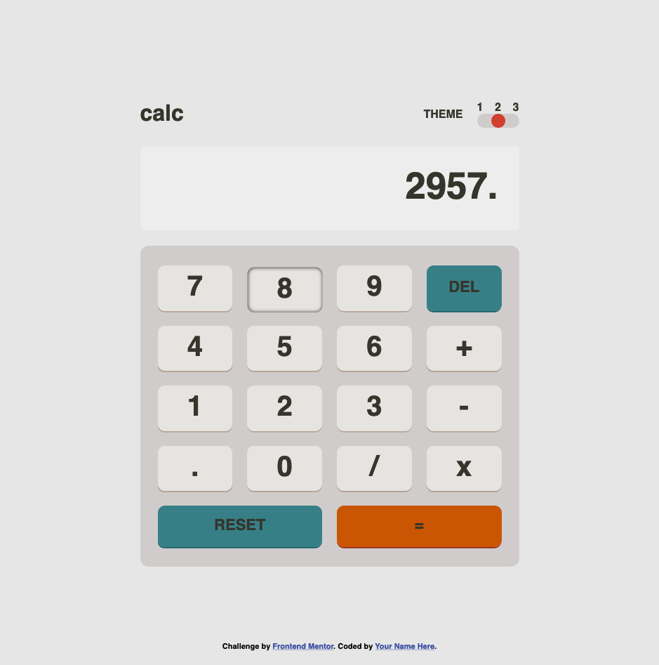

# Frontend Mentor - Calculator app solution

This is a solution to the [Calculator app challenge on Frontend Mentor](https://www.frontendmentor.io/challenges/calculator-app-9lteq5N29). Frontend Mentor challenges help you improve your coding skills by building realistic projects. 

### The challenge

Users should be able to:

- See the size of the elements adjust based on their device's screen size
- Perform mathmatical operations like addition, subtraction, multiplication, and division
- Adjust the color theme based on their preference
- **Bonus**: Have their initial theme preference checked using `prefers-color-scheme` and have any additional changes saved in the browser

### Screenshot

### Links

- Solution URL: [https://github.com/Richard2957/calculator-app-main](https://github.com/Richard2957/calculator-app-main)
- Live Site URL: [https://richard2957.github.io/calculator-app-main/](https://richard2957.github.io/calculator-app-main/)

### Built with

Vanilla CSS and Javascript.

### What I learned

It was hard to get the color scheme right at first because the instructions were unclear.

After what seemed like ages getting the layout and colors right, adding the JS for the actual calculator, and thinking through the logic of how calculators work, was the most fun.

## Author

- Website - [Add your name here](https://www.your-site.com)
- Frontend Mentor - [@Richard2957](https://www.frontendmentor.io/profile/Richard2957)
- Twitter - [@Richard2957](https://www.twitter.com/richard2957)

